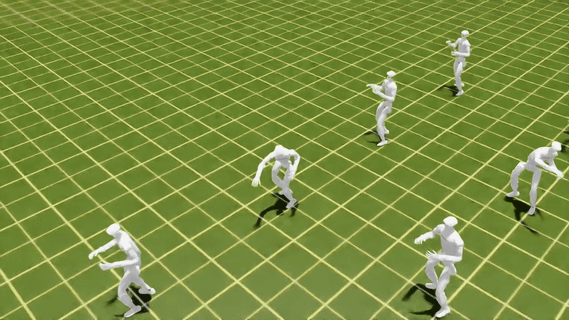

# BeyondAMP: One-Step Integration of AMP into IsaacLab

## Overview

**BeyondAMP** provides a unified pipeline to integrate Adversarial Motion Priors (AMP) into any IsaacLab robot setup, with minimal modifications and full compatibility with custom robot designs. [中文README](./README_cn.md)

## 🚀 Fast Setup

```bash
cd BeyondAMP
bash scripts/setup_ext.sh
# Downloads assets, robot configs, and installs dependencies
```

Optional VSCode workspace setup:

```bash
python scripts/setup_vscode.py
```

## 📌 How to Use

### Quick Start

* Basic environment: `source/amp_tasks/amp_tasks/amp`
* PPO config for G1 robot: `source/amp_tasks/amp_tasks/amp/robots/g1/rsl_rl_ppo_cfg.py`

Training can be launched with:
```bash
python scripts/factoryIsaac/train.py --task BeyondAMP-DemoPunch-G1-BasicAMP --headless
# python scripts/factoryIsaac/train.py --task BeyondAMP-DemoPunch-G1-SoftAMPTrack --headless
# python scripts/factoryIsaac/train.py --task BeyondAMP-DemoPunch-G1-HardAMPTrack --headless
```

To evaluate or visualize a trained checkpoint:
```bash
python scripts/factoryIsaac/play.py --headless --target <path to your ckpt.pt> --video --num_envs 32
```

|  AMP Punch (3k)     | Motion Tracking Punck (30k)         | AMP Dog Move | AMP Knee Walk |
| :------------------------ | :---------------------------- |:------------ |:------------- |
|  |  |  |  |

### Dataset Preparation

The dataset follows the same structure and conventions used in BeyondMimic(whole_body_tracking). All motion sequences should be stored as *.npz files and placed under data/datasets/, maintaining a consistent directory layout with the reference pipeline.

For motion retargeting and preprocessing, GMR is recommended for generating high-quality retargeted mocap data. TrackerLab may be used to perform forward kinematics checks and robot-specific adjustments, ensuring the motions remain physically plausible for your robot model.

With these tools, the dataset organization naturally aligns with the conventions established in BeyondMimic(whole_body_tracking), enabling seamless integration with the AMP training pipeline.

> Following the dataset pipeline of **BeyondMimic**:
> 
> * Motion files: place `*.npz` into `data/datasets/`
> * Recommended tools:
>   * **GMR** for retargeted motion
>   * **TrackerLab** for FK validation & robot-specific preprocessing

### AMP Integration Details

* AMP observation group added via a new `amp` observation config
* RSL-RL integration: `source/rsl_rl/rsl_rl/env/isaaclab/amp_wrapper.py`
* Default transition builder: `source/BeyondAMP/BeyondAMP/amp_obs.py`

> For full tutorial and customization, see `docs/tutorial.md`.


<details>
<summary><strong>Additional Notes</strong></summary>

* Fully modular AMP observation builder
* Compatible with IsaacLab 4.5+
* Designed for rapid experimentation across robot morphologies

</details>

## 🙏 Acknowledgement

### Referenced Repositories

| Repository                                                           | Purpose                               |
| -------------------------------------------------------------------- | ------------------------------------- |
| [robotlib](https://github.com/Renforce-Dynamics/robotlib)            | Robot configurations                  |
| [assetslib](https://github.com/Renforce-Dynamics/assetslib)          | Asset storage                         |
| [TrackerLab](https://github.com/Renforce-Dynamics/trackerLab)        | Data organization & retargeting tools |
| [AMP_for_hardware](https://github.com/escontra/AMP_for_hardware)     | AMP implementation reference          |
| [BeyondMimic](https://github.com/HybridRobotics/whole_body_tracking) | Dataset format & tracking comparison  |

---

## 📘 Citation

```bibtex
@software{zheng2025@BeyondAMP,
  author = {Ziang Zheng},
  title = {BeyondAMP: One step unify IsaacLab with AMP.},
  url = {https://github.com/Renforce-Dynamics/BeyondAMP},
  year = {2025}
}
```

```bibtex
@software{zheng2025@trackerLab,
  author = {Ziang Zheng},
  title = {TrackerLab: One step unify IsaacLab with multi-mode whole-body control.},
  url = {https://github.com/interval-package/trackerLab},
  year = {2025}
}

@INPROCEEDINGS{Escontrela@amphardware,
  author={Escontrela, Alejandro and Peng, Xue Bin and Yu, Wenhao and Zhang, Tingnan and Iscen, Atil and Goldberg, Ken and Abbeel, Pieter},
  booktitle={2022 IEEE/RSJ International Conference on Intelligent Robots and Systems (IROS)}, 
  title={Adversarial Motion Priors Make Good Substitutes for Complex Reward Functions}, 
  year={2022}
  }

@article{liao2025beyondmimic,
  title={Beyondmimic: From motion tracking to versatile humanoid control via guided diffusion},
  author={Liao, Qiayuan and Truong, Takara E and Huang, Xiaoyu and Tevet, Guy and Sreenath, Koushil and Liu, C Karen},
  journal={arXiv preprint arXiv:2508.08241},
  year={2025}
}
```

## Community

| Renforce Dynamics | **Join our WeChat Group** |
|:--|:--|
| |  |
